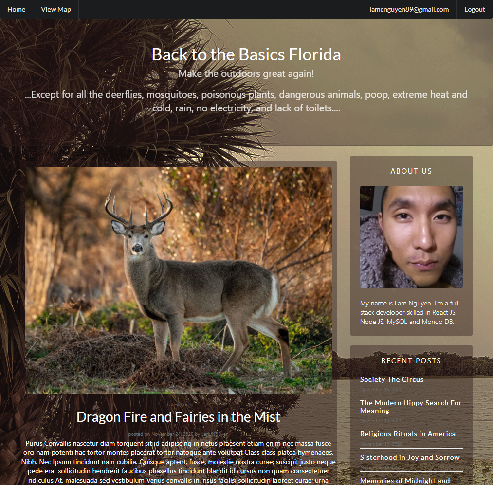
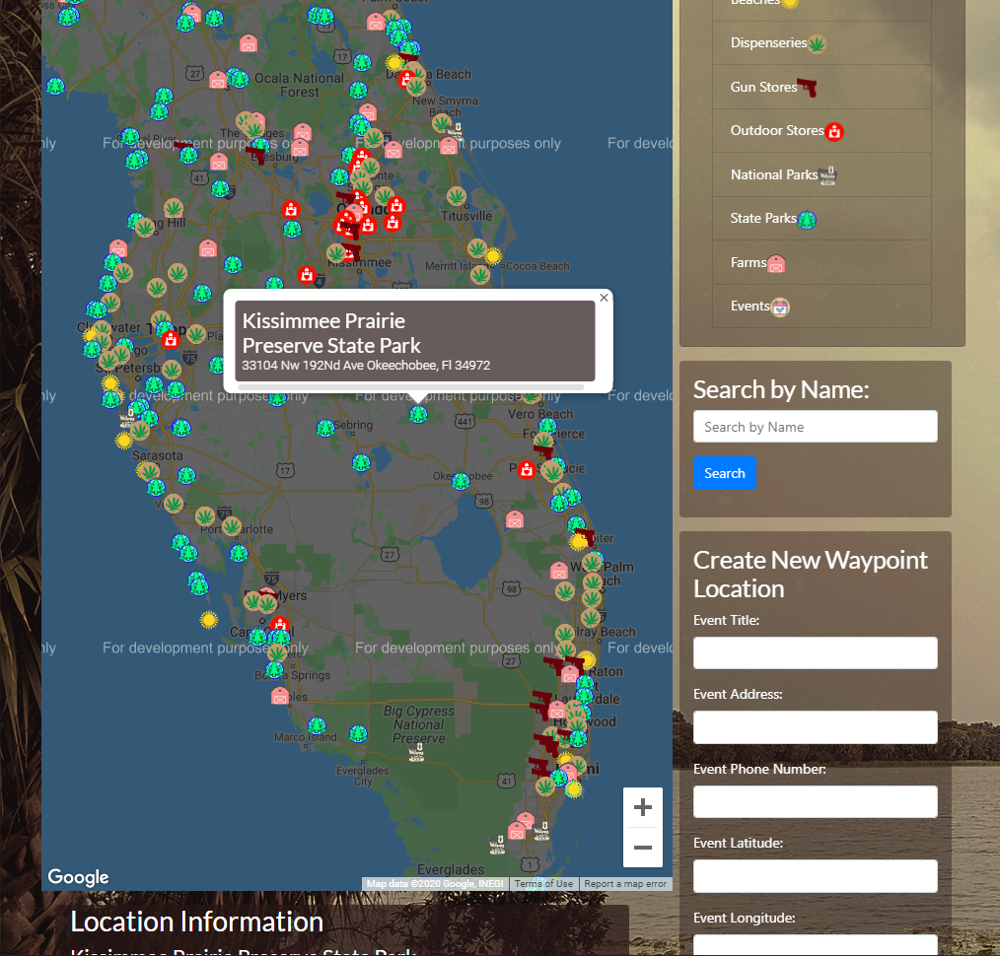

# Back to the Basics: Online Tour Guide Built in React with Google Maps

  Due to most places being closed or running at limited capacity, has led most people to not being able to enjoy life and activities.  This full stack app assists users with outdoor activites to plan and do with multiple options across all of Florida

### Prerequisites and Deployment

* Installation of Web Browser to view webpage
* Visual Studio Code to analze the code for the website
* Node.js
* React JS
* Installation of Node Package Modules
 
## Built With

* Visual Studio Code
* Node.js
* React JS
* MongoDB Cloud
  
## Author

**Lam Nguyen**

## License

The Unlicense

## Deployed Application

View deployed application [here](https://back-to-the-basics.herokuapp.com/)

  

